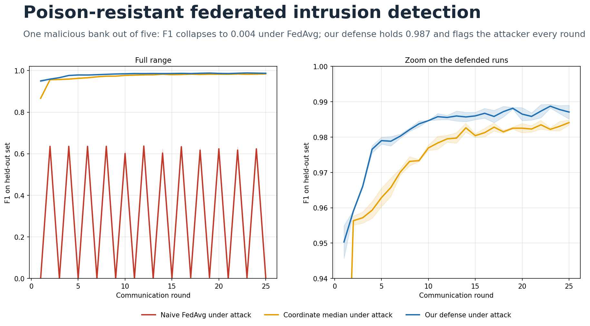
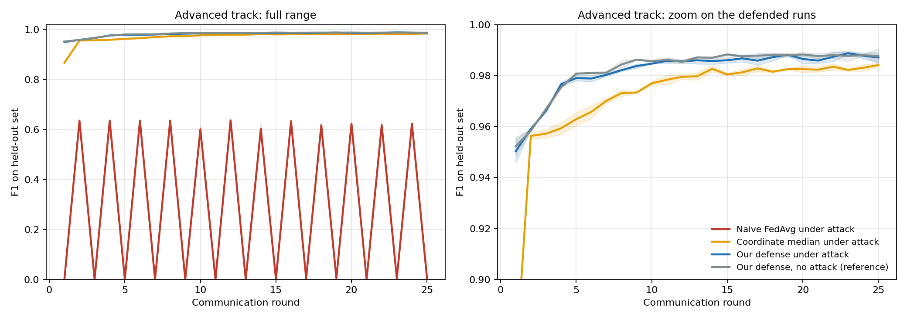
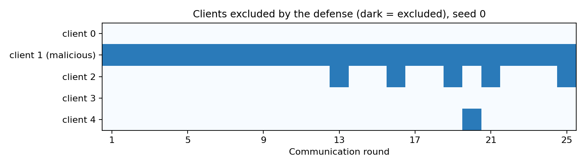
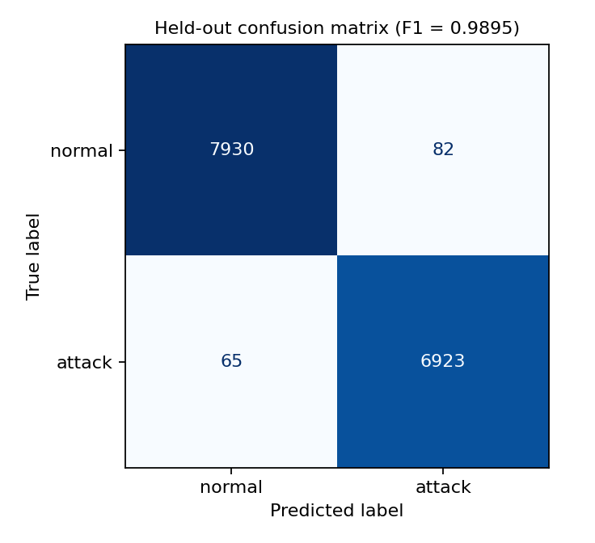

# Poison-Resistant Federated Intrusion Detection



CAIRLab hackathon, Day 2, **Advanced track** (detect or resist a malicious bank).

## The problem

Five banks want to build one shared model that spots network attacks (the NSL-KDD intrusion dataset). They can't share their data with each other, so each bank trains on its own data and sends only its learned update to a central server. The server averages the updates into one shared model. This is called **federated learning**.

The weakness is trust. The server can't see anyone's data, so it has to believe every update. In our scenario, one bank cheats: it flips its labels (teaching the model that attacks are normal and normal traffic is an attack) and sends its update 15 times louder than everyone else's. With plain averaging, that one bank drowns out the four honest ones and the model stops working.

## What is built

A smarter way for the server to combine updates, one that does not blindly trust everyone. Each round it checks three things:

1. **Is any bank shouting?** If an update is more than 3x bigger than the typical one, it is thrown out.
2. **Is any bank pulling the opposite way from the rest?** If so, it is thrown out.
3. **Is anyone who stays still too loud?** Their updates are turned down so nobody dominates.

The server then averages what is left. It also keeps a log of who was thrown out each round, so the defense works as an alarm that points at the attacker as well as a shield.

## Results

Scored on the organizers' 15,000-row held-out set, mean of 3 seeds. F1 is a score from 0 to 1, where 1 is perfect.

| Method | Held-out F1 | What it means |
|---|---|---|
| Plain averaging (FedAvg) under attack | 0.0039 | The model is destroyed by one cheating bank |
| Coordinate median under attack (provided baseline) | 0.9841 | A standard defense, works well |
| **Our defense under attack** | **0.9871** | Nearly back to full strength |
| Our defense, no attack (clean reference) | 0.9876 | What the model scores when nobody cheats |

In short: one bank tried to sabotage the shared model, and with our defense the model performs almost exactly as if it never happened.

The exported model (trained through the attack, seed 0) scores 0.9895 F1 on the held-out set. The cheating bank was excluded in **75 of 75 rounds**. Full analysis, stress tests and limitations are in [`WRITEUP.md`](WRITEUP.md).

### How the score changes over training rounds

Mean of 3 seeds, shaded band = 1 standard deviation. Left: full range. Right: zoom on the defended runs.



### Which banks the defense throws out

Dark cells mark banks excluded in that round (seed 0). Client 1 is the cheater.



### Confusion matrix of the exported model (held-out set)



## Honest caveats

- The edge over the coordinate median is small on this dataset (about +0.003 F1). The big win is against plain averaging.
- The defense assumes most banks are honest. It was not tested with 40% or more cheaters.
- It was not tested against a smarter cheater who copies the size and direction of an honest update.
- Only 5 simulated banks, run on CPU.

## Files

| File | Purpose |
|---|---|
| `federated_ids_advanced.ipynb` | The full experiment with all outputs visible (runs top to bottom, no errors) |
| `model_scripted.pt`, `submission.json` | Exported TorchScript model and metrics file for organizer verification |
| `predictions.csv` | Predictions in `sample_submission.csv` format (`Id`, `Expected`), same row order as `test_public.csv` |
| `results.json` | Every number reported in the write-up |
| `figures/` | Cover image, F1-over-rounds chart, detection map, confusion matrix |
| `WRITEUP.md` | The full write-up |

## Reproduce

```
python -m venv .venv && source .venv/bin/activate
pip install -r requirements.txt
jupyter nbconvert --to notebook --execute --inplace federated_ids_advanced.ipynb
```

Needs internet access to download NSL-KDD from GitHub. About 10 minutes on one CPU thread, no GPU. The data split uses the starter's fixed seed (42) and the federated runs use seeds 0, 1 and 2. Results can differ in the last digit across hardware and library versions.

## Use the exported model

```python
import torch
model = torch.jit.load("model_scripted.pt").eval()
# x: float32 tensor of shape (n, 41), standardized exactly as in Section 1 of the notebook
prediction = (torch.sigmoid(model(x)) > 0.5).int()   # 1 = attack, 0 = normal
```

## Method name

The defense is called `RobustSkewAwareAgg`. It runs the three checks above, then averages the survivors using square-root size weights with server momentum.
